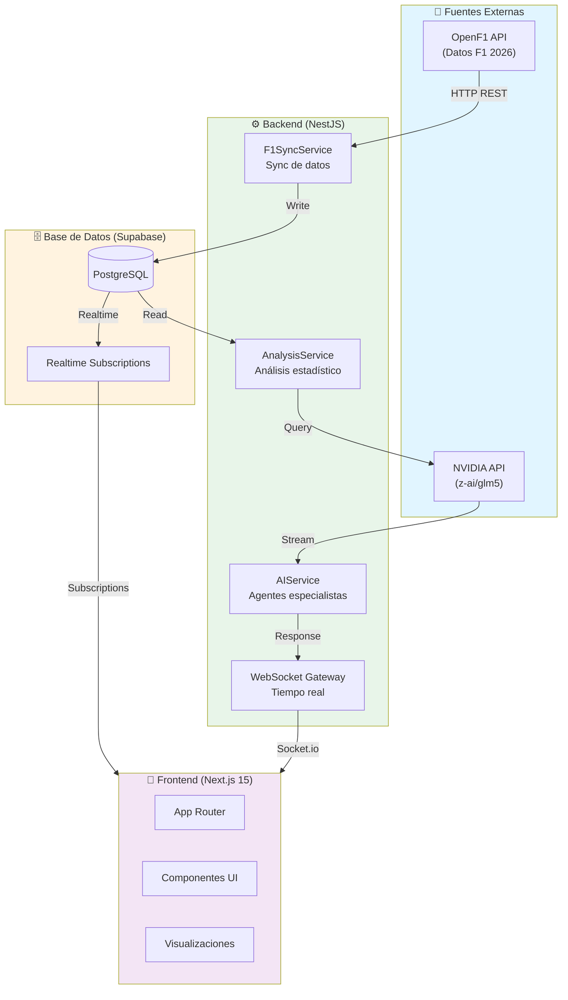
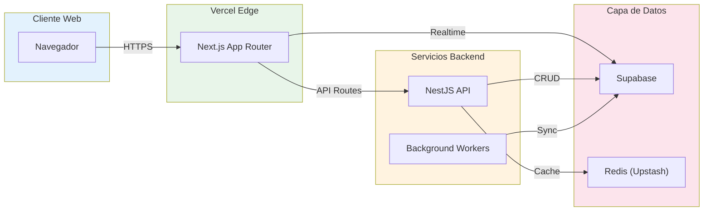
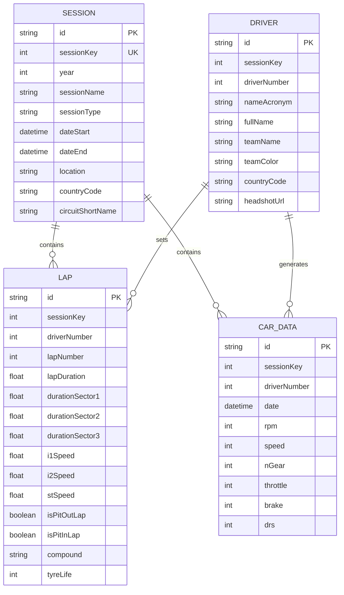
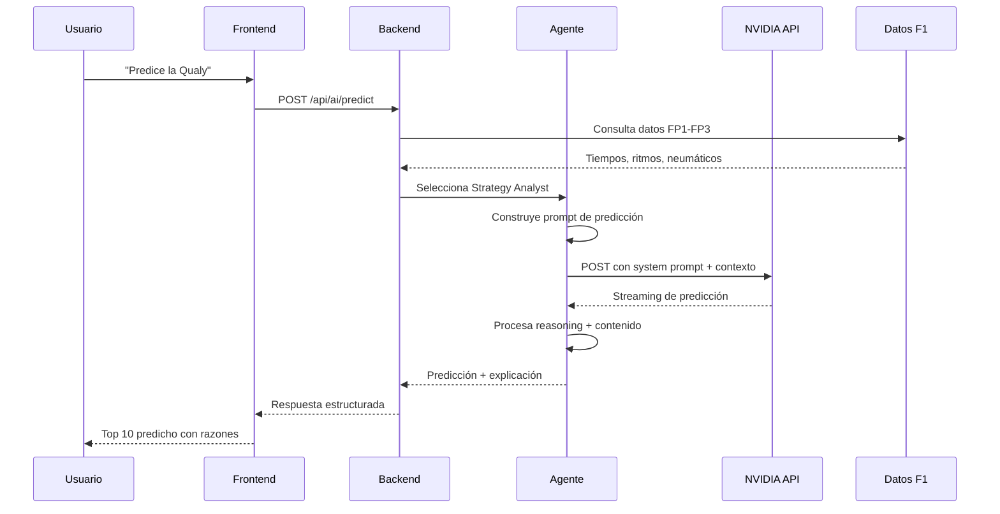
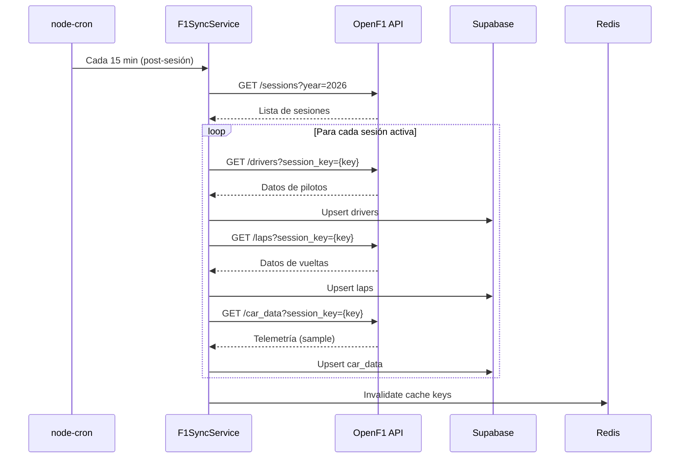
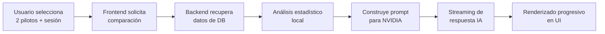

# 🏎️ PitLine - Especificación Técnica

> **Versión**: 1.0.0
> **Última actualización**: 2025-06-03
> **Temporada**: F1 2026

---

## 📋 Índice

1. [Visión del Proyecto](#visión-del-proyecto)
2. [Arquitectura del Sistema](#arquitectura-del-sistema)
3. [Stack Tecnológico](#stack-tecnológico)
4. [Modelos de Datos](#modelos-de-datos)
5. [APIs y Endpoints](#apis-y-endpoints)
6. [Agentes IA](#agentes-ia)
7. [Flujo de Datos](#flujo-de-datos)
8. [Requisitos](#requisitos)
9. [Roadmap](#roadmap)

---

## 🎯 Visión del Proyecto

**PitLine** es una plataforma de análisis de Fórmula 1 que combina datos históricos y en tiempo real con inteligencia artificial para explicar conceptos técnicos complejos de manera visual e interactiva.

### Propuesta de Valor

- 🎨 **Visual-first**: Cada iteración produce resultados visuales inmediatos
- 🤖 **IA Especializada**: Agentes especialistas de F1 explican los datos y hacen predicciones
- 📊 **Comparaciones avanzadas**: Análisis lado a lado de pilotos
- 🎓 **Modo aprendizaje**: Conceptos técnicos explicados con datos reales

### Alcance Temporada 2026

- Solo datos de la temporada 2026 (filtro `year=2026`)
- Pretemporada + Grandes Premios oficiales
- Datos en tiempo real/casi tiempo real durante sesiones (con fallback a post-sesión)
- Acumulación de datos históricos de la temporada 2026

---

## 🏗️ Arquitectura del Sistema



### Diagrama de Componentes



---

## 🛠️ Stack Tecnológico

### Frontend

| Tecnología | Versión | Uso |
|------------|---------|-----|
| Next.js | 15.x | Framework React con App Router |
| React | 19.x | UI Components |
| TypeScript | 5.x | Type safety |
| Tailwind CSS | 4.x | Estilos |
| shadcn/ui | latest | Componentes base |
| Recharts | 2.x | Gráficos estáticos |
| D3.js | 7.x | Visualizaciones complejas |
| Zustand | 5.x | State management |
| React Query | 5.x | Server state |

### Backend

| Tecnología | Versión | Uso |
|------------|---------|-----|
| NestJS | 11.x | Framework Node.js |
| TypeScript | 5.x | Type safety |
| Prisma | 6.x | ORM |
| Socket.io | 4.x | WebSockets |
| node-cron | 3.x | Jobs programados |
| Axios | 1.x | HTTP client |

### Base de Datos & Infraestructura

| Tecnología | Uso |
|------------|-----|
| Supabase | PostgreSQL + Auth + Realtime |
| Redis (Upstash) | Cache y rate limiting |
| Vercel | Hosting frontend + API routes |
| Railway/Render | Hosting NestJS (opción B) |

### IA

| Servicio | Modelo | Uso |
|----------|--------|-----|
| NVIDIA API | z-ai/glm5 | Análisis, explicaciones y predicciones |

---

## 🗄️ Modelos de Datos

### Esquema Prisma

```prisma
// Season filter - solo 2026
generator client {
  provider = "prisma-client-js"
}

datasource db {
  provider = "postgresql"
  url      = env("DATABASE_URL")
}

model Session {
  id                String   @id @default(cuid())
  sessionKey        Int      @unique
  year              Int      // Solo 2026
  sessionName       String   // "Practice 1", "Qualifying", etc.
  sessionType       String   // "Practice", "Qualifying", "Race"
  dateStart         DateTime
  dateEnd           DateTime
  location          String   // "Melbourne"
  countryCode       String   // "AUS"
  circuitShortName  String   // "Melbourne"

  laps              Lap[]
  carData           CarData[]

  @@index([year])
  @@index([sessionKey])
}

model Driver {
  id              String   @id @default(cuid())
  sessionKey      Int
  driverNumber    Int
  nameAcronym     String   // "VER"
  fullName        String   // "Max Verstappen"
  firstName       String
  lastName        String
  teamName        String   // "Red Bull Racing"
  teamColor       String   // "3671c6"
  countryCode     String   // "NED"
  headshotUrl     String?

  laps            Lap[]
  carData         CarData[]

  @@unique([sessionKey, driverNumber])
  @@index([sessionKey])
}

model Lap {
  id                String   @id @default(cuid())
  sessionKey        Int
  driverNumber      Int
  lapNumber         Int
  lapDuration       Float?   // Segundos
  durationSector1   Float?
  durationSector2   Float?
  durationSector3   Float?
  i1Speed           Float?   // Velocidad en intermedio 1
  i2Speed           Float?   // Velocidad en intermedio 2
  stSpeed           Float?   // Velocidad en speed trap
  isPitOutLap       Boolean  @default(false)
  isPitInLap        Boolean  @default(false)
  compound          String?  // "SOFT", "MEDIUM", "HARD"
  tyreLife          Int?     // Vueltas en neumático

  session           Session  @relation(fields: [sessionKey], references: [sessionKey])
  driver            Driver   @relation(fields: [sessionKey, driverNumber], references: [sessionKey, driverNumber])

  @@unique([sessionKey, driverNumber, lapNumber])
  @@index([sessionKey])
  @@index([driverNumber])
}

model CarData {
  id            String   @id @default(cuid())
  sessionKey    Int
  driverNumber  Int
  date          DateTime
  rpm           Int?
  speed         Int?     // km/h
  nGear         Int?     // Marcha
  throttle      Int?     // 0-100
  brake         Int?     // 0-100
  drs           Int?     // 0, 1, 8, 10, 12, 14

  session       Session  @relation(fields: [sessionKey], references: [sessionKey])
  driver        Driver   @relation(fields: [sessionKey, driverNumber], references: [sessionKey, driverNumber])

  @@index([sessionKey, driverNumber])
  @@index([date])
}

model Analysis {
  id            String   @id @default(cuid())
  sessionKey    Int
  driverNumber1 Int
  driverNumber2 Int?
  type          String   // "comparison", "single", "prediction"
  content       String   // JSON con el análisis
  aiResponse    String?  // Respuesta de la IA
  createdAt     DateTime @default(now())

  @@index([sessionKey])
  @@index([createdAt])
}
```

### Diagrama ER



---

## 🔌 APIs y Endpoints

### OpenF1 API (Fuente de Datos)

| Endpoint | Descripción | Filtros útiles |
|----------|-------------|----------------|
| `GET /sessions` | Sesiones de la temporada | `?year=2026` |
| `GET /drivers` | Pilotos por sesión | `?session_key={id}` |
| `GET /laps` | Vueltas por piloto | `?session_key={id}&driver_number={num}` |
| `GET /car_data` | Telemetría | `?session_key={id}&driver_number={num}` |
| `GET /position` | Posiciones en carrera | `?session_key={id}` |
| `GET /pit` | Paradas en boxes | `?session_key={id}` |
| `GET /weather` | Datos meteorológicos | `?session_key={id}` |

### Backend API (NestJS)

#### Sync Endpoints

```typescript
// POST /api/sync/sessions
// Sincroniza sesiones de 2026 desde OpenF1

// POST /api/sync/session/:sessionKey
// Sincroniza datos completos de una sesión
// - Pilotos
// - Vueltas
// - Telemetría (muestra representativa)
```

#### Data Endpoints

```typescript
// GET /api/sessions
// Lista todas las sesiones 2026

// GET /api/sessions/:sessionKey/drivers
// Pilotos de una sesión

// GET /api/sessions/:sessionKey/laps
// Vueltas con filtros opcionales

// GET /api/sessions/:sessionKey/compare
// Query: driver1, driver2
// Compara dos pilotos con análisis
```

#### AI Endpoints

```typescript
// POST /api/ai/analyze
// Analiza una comparación o sesión
// Body: { sessionKey, driver1, driver2?, question?, agentType }

// POST /api/ai/predict
// Predice resultado de Qualy basado en Practices
// Body: { sessionKey, predictionType: 'qualifying' | 'race' }

// POST /api/ai/chat
// Chat conversacional con contexto
// Body: { messages[], sessionContext?, driverContext? }

// GET /api/ai/agents
// Lista agentes disponibles con descripciones
```

---

## 🤖 Agentes IA

Los agentes son especialistas de F1 implementados como prompts de sistema para la API de NVIDIA (z-ai/glm5). Cada uno tiene expertise específico y personalidad distintiva.

### Estructura de Agente

```typescript
interface F1Agent {
  id: string;
  name: string;
  role: string;
  expertise: string[];
  personality: string;
  systemPrompt: string;
  tools: string[];
  responseFormat: 'technical' | 'conversational' | 'educational';
}
```

### Tipos de Predicciones con IA

| Tipo de Predicción | Inputs | Output | Confianza |
|-------------------|--------|--------|-----------|
| **Qualy Prediction** | FP1, FP2, FP3 tiempos | Top 10 Qualy | 60-80% |
| **Race Strategy** | Practice pace, tire degradation | Optimal strategy | 50-70% |
| **Overtake Probability** | Track position, tire delta | % de éxito | 40-60% |
| **Pit Window** | Race situation, tire life | Best pit lap | 50-70% |

**Nota**: Las predicciones incluyen disclaimer de que son estimaciones basadas en datos históricos y no garantías.

### Flujo de Interacción



Ver [AGENTS.md](./AGENTS.md) para documentación completa de cada agente.

---

## 🔄 Flujo de Datos

### Sincronización Post-Sesión



### Funcionalidad Especial: Modo Colapinto

Dashboard dedicado para análisis en tiempo real de Franco Colapinto con integración de IA contextual.

#### Características

| Característica | Descripción |
|----------------|-------------|
| **Datos en Vivo** | Posición, última vuelta, delta con líder, neumático actual, ritmo de carrera |
| **Análisis Comparativo** | Vs compañero de equipo (Albon), vs pilotos cercanos, tiempos por sector |
| **IA Contextual** | Preguntas como "¿Por qué está P16?" o "¿Dónde terminará P3?" con análisis de datos en vivo |
| **Alertas Inteligentes** | Mejoras de tiempo personal, oportunidades de adelantamiento, ritmos anómalos |

#### Preguntas Ejemplo a la IA

```
Usuario: "¿Por qué Colapinto está P16 y no más adelante?"

IA Analiza:
- Ritmo de vuelta actual vs pilotos P10-P20
- Tráfico en pista (bandera azul reciente?)
- Degradación de neumáticos vs stint óptimo
- Comparación con Albon (mismo equipo)
- Estrategia de paradas vs pit window ideal

Respuesta: "Está P16 porque su ritmo en S2 es 0.3s más lento que Albon.
Los neumáticos mediums tienen 15 vueltas (sweet spot: 12-18).
El tráfico con Tsunoda en vuelta 23 le costó 0.5s.
Predicción: puede llegar a P12 si mantiene este ritmo."
```

```
Usuario: "¿Dónde terminará en P3 si faltan 40 minutos?"

IA Analiza:
- Ritmo actual vs ritmo de pilotos P1-P10
- Degradación proyectada en 40 minutos
- Probabilidad de safety car (histórico circuito)
- Estrategia óptima de paradas restantes
- Tiempos de los 5 pilotos adelante

Respuesta: "Basado en tu ritmo actual (1:32.4 avg), proyectas terminar
P8-P10. Para llegar a P5 necesitarías mejorar 0.4s/vuelta.
Recomendación: próximo stint con softs, push en S3 donde eres más débil."
```

#### Endpoint Específico

```typescript
// GET /api/colapinto/live
// Devuelve datos en tiempo real de Colapinto

// POST /api/colapinto/ask
// Body: { question: string, sessionContext: {...} }
// IA responde basándose en datos en vivo
```

#### Agente Especializado

**Colapinto Analyst**: Agente IA especializado en datos de Franco Colapinto con contexto histórico de sus sesiones en 2026.

### Flujo de Análisis en Tiempo Real



---

## ✅ Requisitos

### Funcionales

| ID | Requisito | Prioridad |
|----|-----------|-----------|
| F1 | Ver grid de equipos con pilotos 2026 | Must |
| F2 | Listar todas las sesiones de la temporada | Must |
| F3 | Ver tabla de resultados por sesión | Must |
| F4 | Comparar tiempos de 2 pilotos visualmente | Must |
| F5 | Gráfico de evolución de vueltas | Must |
| F6 | Análisis IA de comparaciones | Must |
| F7 | Predicciones de Qualy con IA | Must |
| F8 | Chat conversacional con contexto | Should |
| F9 | Mapa de velocidad en pista | Should |
| F10 | Modo aprendizaje de conceptos F1 | Could |
| F11 | Predicciones de estrategia de carrera | Could |
| F12 | **Modo Colapinto** - Análisis en tiempo real de Franco Colapinto | **Must** |

### No Funcionales

| ID | Requisito | Target |
|----|-----------|--------|
| NF1 | Tiempo de carga inicial | < 2s |
| NF2 | Streaming IA primer token | < 1s |
| NF3 | Soporte offline (datos cacheados) | Partial |
| NF4 | Responsive design | Mobile-first |
| NF5 | Accesibilidad WCAG | AA |

---

## 🗓️ Roadmap

### Iteración 1: Grid de Equipos (Días 1-2)
- [ ] Setup Next.js + Tailwind
- [ ] Cliente OpenF1 básico
- [ ] Componente TeamCard
- [ ] Grid visual de equipos 2026

### Iteración 2: Temporada 2026 (Días 3-4)
- [ ] Setup Supabase
- [ ] Sync de sesiones
- [ ] Vista de calendario
- [ ] Detalle de sesión

### Iteración 3: Vista de Resultados (Días 5-6)
- [ ] Tabla de resultados estilo F1
- [ ] Sync de vueltas
- [ ] Ranking por sesión

### Iteración 4: Comparador (Días 7-9)
- [ ] Setup NestJS
- [ ] Gráfico de tiempos (Recharts)
- [ ] Selección de pilotos

### Iteración 5: IA - Análisis y Predicciones (Días 10-12)
- [ ] Integración NVIDIA API
- [ ] Agent básico (Performance)
- [ ] Análisis automático de comparaciones
- [ ] Predicción de Qualy

### Iteración 6: Chat IA (Días 13-14)
- [ ] UI de chat
- [ ] Contexto de sesión
- [ ] Streaming de respuestas

### Iteración 7: Polish (Día 15)
- [ ] Animaciones
- [ ] Modo oscuro
- [ ] Optimizaciones

---

## 📊 Métricas de Éxito

- **Tiempo de setup**: < 5 minutos para nuevo desarrollador
- **Coverage de tests**: > 70%
- **Lighthouse score**: > 90 en todas las categorías
- **Tiempo de respuesta API**: P95 < 500ms
- **Uso de IA**: < $50/mes en NVIDIA API

---

## 🔒 Seguridad

- API keys en variables de entorno
- Rate limiting en endpoints de IA
- Validación de inputs con Zod
- RLS policies en Supabase
- Sanitización de datos de OpenF1

---

## 📝 Notas

- La API de OpenF1 es gratuita con rate limits; puede proporcionar datos en tiempo real durante sesiones
- Los datos de la temporada 2026 se acumulan y persisten en nuestra base de datos
- La IA se usa para análisis y predicciones (siempre con disclaimers de estimación)
- El modo "explicar como si tuviera 5 años" usa prompts simplificados

---

**Documentación relacionada:**
- [AGENTS.md](./AGENTS.md) - Especialistas IA
- [USER_STORIES.md](./USER_STORIES.md) - Historias de usuario
- [README.md](../README.md) - Setup y uso

### 4️⃣### __Carpeta /utils - ¿Buena práctica?__

__Sí, pero con estructura clara__. La carpeta `/utils` es buena práctica SI está bien organizada:

```javascript
lib/
├── utils/
│   ├── formatters/          # Formateo de datos
│   │   ├── time-formatter.ts    # formatLapTime, formatSectorTime
│   │   ├── date-formatter.ts    # formatSessionDate
│   │   └── number-formatter.ts  # formatSpeed, formatDelta
│   │   └── index.ts
│   ├── calculations/        # Cálculos
│   │   ├── lap-calculations.ts  # calculateDelta, calculateConsistency
│   │   ├── pace-analysis.ts     # calculateRacePace
│   │   └── index.ts
│   ├── validators/          # Validación
│   │   ├── input-validator.ts
│   │   └── index.ts
│   └── index.ts             # Barrel file
```
